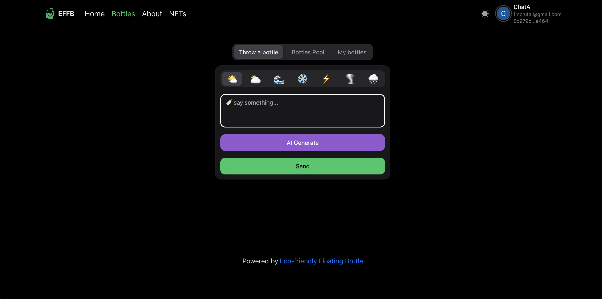

# 环保漂流瓶

[English Introduce](./README.md) |  [website](https://operational-sunshine-converter-encountered.trycloudflare.com)

### 简介: 

```EFFB ( Eco Friendly Floating Bottle ) 是一个专门为用户和环境保护而设计的 Web3 奖励社交网络。 EFFB 是一个真正意义上的全球平台，来自世界各地的用户可以通过参与漂流瓶赚取积分。EFFB 提供了一个独特的价值主张——将区块链的最佳属性与远远超出加密生态系统的行业相结合，这使其与大多数加密项目相比独具特色且与众不同，拥有更大的目标市场规模。```


### 什么是EFFB: 

EFFB 提供了一种利用 Web3 技术实现 **AI**、**社交化**、**增强用户参与度** 的解决方案，并以一种特别吸引早期采用者、社交玩家和区块链技术支持者的形式促进**环境保护**。

简言之，EFFB 是一个基于 Web3 的奖励社交发现协议，旨在平等地惠及用户和公众利益。

它利用区块链技术，使用户能够将他们的数字足迹和参与转变为一种促进公益的合作力量。譬如用户可在 App 上发送环保推广内容而获得环保基金，并能通过参与各种环保活动赢得环保基金，且环保基金由获胜者和环保组织共享。

这就是利用区块链技术的社区驱动力，将赢得奖励的刺激感与汇集捐款的力量相结合，从而实现社会变革的新方式。


# 社交行业发展概述

随着Web3技术和基建的发展，社交赛道也迎来了新的发展机会，匿名性、抗审查性、用户掌握数据所有权等都吸引着用户和开发者探索新的社交工具。当前Web3社交赛道已吸引了部分开发者和资本的参与，整个社交生态有数百个项目开发，社交、身份、NFT、DAO、粉丝等都可以归类到Web3社交的范畴中，生态项目较为丰富，吸引到了大量的用户和市场关注.


# 社交赛道特点

```对于Web3社交，目前尚没有统一的定义，我们可以将所有涉及到人与人的信息发布、交换、可用于用户刻画的产品归类到社交这一领域，从目前的发展成果来看，主要包括社交公链、社交图谱、社交身份、各类型的社交应用、服务类工具等。```

### Web3社交发展的关键因素包括：

#### 1. 匿名性、抗审查性
相对于Web2社交，Web3社交最大的优势之一即是匿名性和抗审查性，这一特性本身在当下就已经被验证为用户的需求之一。
去中心化的Web3天然具有保护用户隐私、抗中心化机构审查的特点，这些特点可以满足用户保护隐私和维护自身安全的诉求。

#### 2. 用户掌握数据所有权
在Web3领域，可以通过使用户掌握数据所有权实现用户对数据流量商业价值的获取。从用户角度出发，设计出能让用户
便捷地实现数据价值变现的项目对用户来说具有一定的吸引力。
在Web3中，由于代币的多元性、代币本身价值的波动性、以及代币经济设计的丰富性，对数据所有权商业价值变现在Web3
中可以衍生出非常多吸引用户的有趣玩法，具备甚至超过上一轮链游牛市所创造的造富效应和拉新效应。

#### 3. 可组合性
理想的Web3社交类产品或有机会解决数据孤岛的问题，类似POAP、ENS等对用户画像的描绘可以视作对数据孤岛的问题的解决的尝试。在未来，或会出现更加简单、无门槛的标准协议，在帮助用户实现便捷地掌握数据所有权的情况下，同时兼容对大多数协议的接入

# 现在遇到的困境

如何引入大量的用户，是Web3社交项目所面临的最大的挑战和机遇。当前加密领域发展受限的重要原因之一用户基数太少，
一是用户进入加密领域有一定的学习门槛，用户需要掌握一定的计算机和加密知识，才能参与链上交互，
二是当前的加密项目相比Web2的用户工具使用较为复杂，不够简单便捷.
以EOA钱包为例，复杂的助记词和保存方式、潜在的被钓鱼和盗取私钥的风险、软件之间的更新迭代和兼容性问题
等均影响了用户体验。将大量的Web2用户拦在加密世界之外，相对地，这也意味着，一旦能解决学习成本和进入门槛的问题，一旦有能够简单上手、让用户无感操作的社交项目的诞生，则将带来巨大的用户流量。

# 用户引流方式

### 1.社交媒体
通过社交媒体平台（如Facebook、Instagram、Twitter、Discord等）和 环保漂流瓶 传播环保事业的重要性和平台的价值，通过**token空投**来免费引流, 吸引更多用户参与。
### 2.合作与教育引导
与各种环保组织、学校、企业合作，共同推广环保事业并吸引他们的成员参与到平台中, 推出互动性强的环保主题活动或挑战，鼓励用户参与并分享，进一步扩大环保影响力。
### 3.内容创新
不断创造新颖、有趣、具有教育意义的环保内容，如短视频、直播、图文等，以吸引更多用户的注意力，提高他们的环保意识和参与度。

<!-- # 为什么要选Morph做项目?


### 1. 无钥匙账户
Keyless技术使得用户无需携带或记忆钥匙或密码，因此提供了更便利社交的使用体验。让Web3用户,可以不通过钱包使用此Dapp(环保漂流瓶), 通过谷歌登录降低用户的使用门槛, 让更多的非Web3玩家无痛进入Morph平台, 成为流量入口门户.

### 2. 代付
在Web3提供的代付功能下，我们的产品将实现无需用户支付Gas费即可免费使用的优势。这意味着用户不再需要担心每次使用产品都要支付的费用，大大提高了产品的吸引力和用户体验。与传统支付模式相比，我们的代付功能为用户提供了无缝、无负担的体验。

与此同时，我们的产品与代付功能高度契合。例如，对于类似微信的即时消息产品，代付功能使得用户发送每条消息都不再需要支付费用，这将极大地减少用户的心理负担，提高产品的粘性和使用率。我们的产品和代付功能的结合，为用户提供了更加便捷、经济实惠的体验，有助于吸引更多用户并促进产品的发展和增长。

### 3. 随机数
利用链上随机数的伟大突破，我们的产品可以实现基金奖励的随机生成，无需依赖线下预言机。这一特性不仅为我们的产品提供了更高的安全性和可靠性，还极大地降低了操作成本和复杂性。 -->


# 对 Morph 的协同作用和贡献

1. Morph 缺乏环保经济和社交领域的项目，因此 EFFB 可以填补这一空白并提供独特的价值。

2. EFFB 将把不同类型的用户带入 Morph 生态系统，扩大和丰富Morph社区。

3. 通过内部和外部的代币经济设计，EFFB将使社交用户，而不仅仅是投机者，获得真正的收入并超越庞氏模式。这与 Morph 构建真正实用性和价值的目标一致。

4. EFFB 将充分利用 Morph 的高性能、可扩展性和 AI 功能来无缝集成我们的 AI 模型，从而实现世界环保的宣传, 以及通过预言机获取用户所在地的天气数据。

5. 通过专注于社区，EFFB 将引入深度投资和参与的用户群，进一步增加 Morph 上的活动和交易。

6. EFFB 的社交化和透明方法将向新用户群体展示区块链的优势，充当主流消费者亲身体验 Morph 优势的入口门户。

7. 作为社区驱动的社交和世界环保讲述的创新模式，EFFB 将重点介绍新的用例，展示 Morph 的多功能性和支持下一代应用程序的能力。


# 环保漂流瓶 玩法

### 1. 发布漂流瓶

    1. 标签
      通过发布带 环保\风力\新能源 等标签的漂流瓶内容, 根据用户所在地的天气, 来获取一定量的环保基金奖励
      天气晴朗则获取的奖励较多, 天气恶劣(PM2.5含量过高)则不获取奖励, 鼓励全球一起来参与环保行动, 改善身边的环境.
    2. 稀有生物Nft
      通过发布漂流瓶,每次都有机会,抽取世界超稀有生物nft, 稀有生物和普通ntf.
    3. 收集环保Idea
      通过漂流瓶内的一个模块,公开征集环保idea, 达到一定的曝光量, 然后通过Dao组织的形式,  通过投票进行推广此Idea.
      此Idea的提出者,获得大量的环保基金奖励, 有机会获得官方公开投资推广.
    4. 每周小目标 
      在每个周期内(周一 ~ 周日),单条漂流瓶点赞率达到4%,且发布7天内拾起率达到 5000/10000/50000/100000/5000000, 可获得瓜分倍数的2/3/6/8/15倍,
      可参与瓜分100万环保基金奖池.
    5. 每月涨粉攻擂赛 
      在每个周期(当月1号 ~ 当月底)内, 完成一定数量的涨粉增量,可参与瓜分200万环保基金奖池.
    6. 发布频率
      在每个周期内(周一 ~ 周日), 达到每日发布签到, 每周最少发布三天, 可参与瓜分50万环保基金奖池.
    7. 环保课堂激励计划
      在平台发布环保课程, 并且开启免费试看, 给予一定量环保基金奖励.


### 2. 环保志愿活动
将公开组织一些环保活动, 参与环保志愿活动将纳入奖励体系，在环保推广内容奖励基础上，增加更多实际的环保行为作为用户参与的条件，如参加环保志愿活动、节约能源和减少垃圾等。

### 3. AI生成发布环保宣传
通过AI(文字/图片/视频/声音等媒介)自动生成漂流瓶宣传环保概念，鼓励用户在日常生活中节约能源、减少垃圾产生，培养环保习惯，为环境保护贡献力量。

### 4. 政策一扫通
通过参与环保漂流瓶活动，用户可以通过扫描漂流瓶上的二维码，了解环境问题，并了解全球各国政府对环保事业的重视和环境保护法律法规的制定和执行情况。


# 想象

AI 融合了世界环保推广, 以及社交, 将大规模的环保理念融入世界不断发展的故事中。通过用户发布环保理念或者故事, 来让用户提升对环保的认识和改变. **通过用户所在地区的天气**,来给予作者奖励. 还会有更多玩法: 比如 **收集环保想法, 点赞率, 关注量, 发布频率**等等环保活动等待大家参加.

EFFB  的一个独特之处在于它对环境保护的承诺 ---- 是第一个专门为用户和公众利益而设计的 Web3 奖励社交网络。

```该模式将慈善捐赠与个人收益相结合，这两个方面和谐地协作，确保 EFFB 的玩家不仅受自身利益驱动，同时也与社区支持地球环保更广泛的目标保持一致。```

```EFFB 平台每向用户发放一份奖励，就会向致力于环境保护的组织做出同等捐赠。这种「双重激励」模式确保用户参与不仅能带来个人奖励，还能为与社区整体目标一致的更大目标做出贡献。该平台承诺将奖励与保护工作相匹配，有效地将日常在线活动（例如发布漂流瓶）转化为轻而易举的环保行为。```

地球的健康是我们这个时代最紧迫和最重要的挑战之一，不仅对保护自然界至关重要，而且对确保包括人类在内的所有物种的可持续未来至关重要。年轻的加密原生用户往往认为拯救地球是我们这个时代最重要的问题，因此通过利用数字化参与来促进环境保护，EFFB 展示了一个如何利用技术和 Web3 创新来支持可持续性和环境保护目标的模型。

这种创新旨在用户中培养社区意识和共同目标，他们可以看到自己的行动对地球的直接影响。

EFFB 承诺支持四个经过核实的环境保护组织：**海洋清理组织、国际自然保护联盟、自然保护协会和阿根廷野生动物基金会**。

# 团队成员介绍

### MaxWell Pan (Owner)
作为Web3全栈开发专家，致力于推动Web3技术在环保领域的应用和布道，以打造智能、可持续的未来为己任。不仅在技术上深耕，更是环保事业的虔诚信徒，将人工智能与Web3技术相融合，致力于打造一系列创新产品，以解决当今环保挑战，并鼓励更多的华语开发者和用户加入到这一崭新的Web3环保生态中。

### Finch
资深全栈工程师和AI 开发者。致力于将 AI 技术应用于环保事业，以推动可持续发展和环境保护。
正在探索如何利用区块链技术来建立可追溯的供应链，以确保产品的可持续性和环保性。以及如何利用智能合约来实现环保奖励机制，以鼓励更多的人参与到环保行动中来。

# 代币经济学

### 代币

符号：“$EFFB”

Total: 100000000000000


### 代币供应量

25000000000000 %25 用户 

25000000000000 %25 环保组织

20000000000000 %20 烧毁

10000000000000 %10 营销空投

16000000000000 %16 团队发展

4000000000000 %4 营销基金

### 解释

我们将根据市场交易情况分批增加流动性。

关于空投，我们将使用10%的代币进行营销空投。关于空投的具体规则，请关注官方公告。


# 联系我们

X:  https://twitter.com/YongxuPan

电子邮件:  panyx1002@gmail.com

### PC 官网





