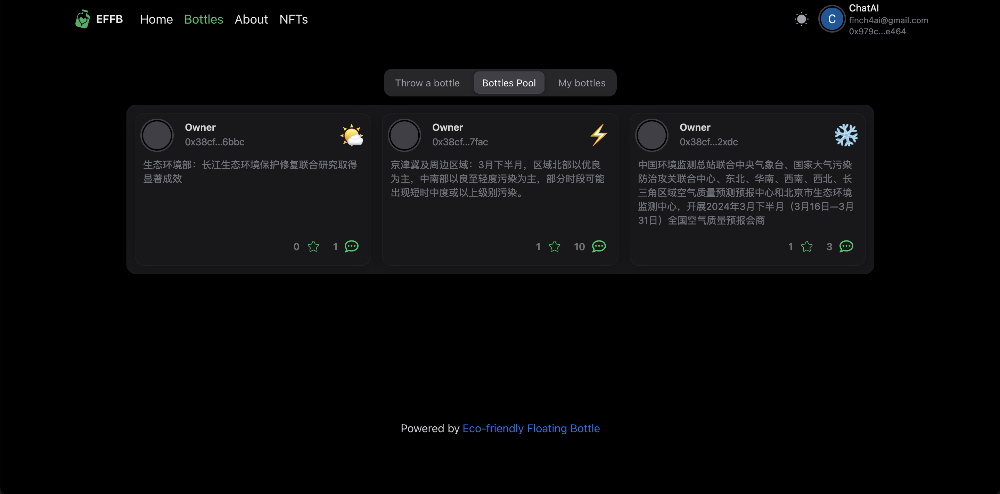

# Eco Friendly Floating Bottle

[中文介绍](README-zh.md)  |  [官网](https://operational-sunshine-converter-encountered.trycloudflare.com)

### Introduction:

```EFFB (Eco Friendly Floating Bottle) is a Web3 reward social network designed specifically for users and environmental protection. EFFB is a truly global platform where users from all over the world can earn points by participating in drifting bottles. EFFB offers a unique value proposition - combining the best attributes of blockchain with industries far beyond the crypto ecosystem, making it distinctive and different from most crypto projects, with a larger target market size.```


### What is EFFB:

EFFB offers a solution that utilizes Web3 technology to achieve **AI**, **socialization**, and **enhanced user engagement**, promoting **environmental protection** in a form that particularly attracts early adopters, social players, and blockchain technology supporters.

In short, EFFB is a Web3-based reward social discovery protocol aimed at equally benefiting users and the public interest.

It leverages blockchain technology to enable users to transform their digital footprints and engagement into a collaborative force for promoting the public good. For example, users can earn environmental funds by posting environmental promotional content on the app and can win environmental funds by participating in various environmental activities, with the environmental funds shared by winners and environmental organizations.

This is a new way of social change utilizing blockchain technology's community-driven force, combining the sense of winning rewards with the power of pooling donations, thereby achieving societal change.

# Overview of Social Industry Development

With the development of Web3 technology and infrastructure, the social track has also ushered in new opportunities. Anonymity, censorship resistance, user ownership of data, and other factors attract users and developers to explore new social tools. The current Web3 social track has attracted the participation of some developers and capital, with hundreds of projects in the social ecosystem, including social chains, social graphs, social identities, various types of social applications, service tools, etc., attracting a large number of users and market attention.

# Characteristics of Social Track

```For Web3 social, there is currently no unified definition. We can classify all products involving information dissemination, exchange, and user portrayal into the field of socialization. From the current development achievements, it mainly includes social public chains, social graphs, social identities, various types of social applications, service tools, etc.```

### Key factors driving the development of Web3 social:

#### 1. Anonymity, censorship resistance

Compared to Web2 social, one of the biggest advantages of Web3 social is anonymity and censorship resistance, a feature that has already been verified as one of the user's demands at present.
Decentralized Web3 inherently has the characteristics of protecting user privacy and resisting centralized institutional censorship. These characteristics can meet the user's demands for protecting privacy and maintaining their own security.

#### 2. User ownership of data

In the Web3 field, user ownership of data can be realized to obtain the commercial value of data traffic for users. From the user's perspective, projects that enable users to conveniently realize the commercial value realization of data have a certain appeal.
In Web3, due to the diversity of tokens, the volatility of token value, and the richness of token economic design, the commercial value realization of data ownership can derive many interesting gameplay methods that attract users, which may even exceed the wealth creation effect and new user effect created by the previous round of chain game bull market.

#### 3. Composability

An ideal Web3 social product may have the opportunity to solve the problem of data silos, similar to attempts to depict user profiles such as POAP and ENS. In the future, simpler and more accessible standard protocols may appear to help users conveniently grasp data ownership while being compatible with access to most protocols.

# Current Challenges

How to introduce a large number of users is the biggest challenge and opportunity for Web3 social projects. One of the important reasons limiting the development of the encryption field is that the user base is too small,
First, there is a certain learning curve for users to enter the encryption field. Users need to master certain computer and encryption knowledge to participate in on-chain interactions,
Second, compared to Web2 user tools, current encryption projects are more complex and less simple and convenient to use.
For example, taking the EOA wallet as an example, the complex mnemonic and storage methods, potential phishing and theft of private keys, software update iterations, and compatibility issues between software all affect the user experience. Keeping a large number of Web2 users out of the encrypted world, relatively, this also means that once the problem of learning costs and entry barriers is solved, once there is a social project that is easy to use and allows users to operate without feeling, it will bring huge user traffic.

# User Acquisition Methods

### 1. Social Media
Spread the importance of environmental protection and the value of the platform through social media platforms (such as Facebook, Instagram, Twitter, Discord, etc.) and Eco Friendly Floating Bottle, and attract more users to participate through **token airdrops**.
### 2. Collaboration and Educational Guidance
Collaborate with various environmental organizations, schools, and companies to jointly promote environmental protection and attract their members to participate in the platform. Launch interactive environmental-themed activities or challenges, encourage user participation, and sharing to further expand environmental influence.
### 3. Content Innovation
Continuously create novel, interesting, and educational environmental content, such as short videos, live broadcasts, graphics, etc., to attract more attention from users and increase their environmental awareness and participation.

<!-- # Why Choose Morph for the Project?


### 1. Keyless Account
Keyless technology allows users to access social features without carrying or remembering keys or passwords, providing a more convenient social experience. With Keyless technology, Web3 users can use this Dapp (Eco Friendly Floating Bottle) without a wallet, reducing the user threshold by logging in with Google, allowing more non-Web3 players to seamlessly enter the Morph platform and become a traffic entry portal.

### 2. Pay for Another
With the gas fee proxy feature provided by Web3, our product will enjoy the advantage of being used for free without users having to pay gas fees. This means that users no longer have to worry about the cost of using the product each time, greatly enhancing the attractiveness and user experience of the product. Compared to traditional payment models, our gas fee proxy feature provides users with a seamless, burden-free experience.

Meanwhile, our product is highly compatible with the gas fee proxy feature. For example, for instant messaging products similar to WeChat, the gas fee proxy feature allows users to send each message without paying a fee, greatly reducing the psychological burden on users and increasing the stickiness and usage of the product. The combination of our product and the gas fee proxy feature provides users with a more convenient, cost-effective experience, helping to attract more users and promote the development and growth of the product.

### 3. Random Number
By utilizing on-chain random number generation, our product can achieve the random generation of fund rewards without relying on offline oracles. This feature not only provides higher security and reliability for our product but also greatly reduces operational costs and complexity. -->


# Synergy and Contribution to Morph

1. Morph lacks projects in the environmental economy and social fields, so EFFB can fill this gap and provide unique value.
2. EFFB will bring different types of users into the Morph ecosystem, expanding and enriching the Morph community.
3. Through internal and external token economic design, EFFB will enable social users, not just speculators, to truly earn income and surpass Ponzi schemes. This is consistent with Morph' goal of building practicality and value.
4. EFFB will fully utilize Morph' high performance, scalability, and AI capabilities to seamlessly integrate our AI models, enabling worldwide environmental promotion and obtaining weather data of users' locations through oracles.
5. By focusing on the community, EFFB will introduce a deeply invested and engaged user base, further increasing activities and transactions on Morph.
6. EFFB's social and transparent approach will showcase the advantages of blockchain to new user groups, serving as a gateway for mainstream consumers to experience the advantages of Morph firsthand.
7. As a community-driven social innovation model for environmental protection storytelling, EFFB will focus on introducing new use cases, demonstrating Morph' versatility and ability to support next-generation applications.

# Eco Friendly Floating Bottle Gameplay

### 1. Drifting Bottle Release

    1. Tags
      By publishing drifting bottle content with tags such as environmental, wind power, and new energy, users can earn a certain amount of environmental funds based on the weather in their area. If the weather is sunny, they will receive more rewards, while if the weather is severe (PM2.5 content is too high), they will not receive rewards, encouraging global participation in environmental actions to improve the environment around them.
    2. Rare Wildlife NFT
      By releasing drifting bottles, there is a chance to draw world-class rare wildlife NFTs, both rare and common NTFs.
    3. Collect Environmental Ideas
      Through a module in the drifting bottle, publicize the collection of environmental ideas. When a certain exposure is reached, promote this idea through the form of DAO organization and vote. The proposer of this idea will receive a large amount of environmental fund rewards and have the opportunity to receive official public investment promotion.
    4. Weekly Small Goals
      Within each cycle (Monday to Sunday), if the like rate of a single drifting bottle reaches 4%, and the pick-up rate within 7 days of publication reaches 5000/10000/50000/100000/5000000, participants can get 2/3/6/8/15 times the multiplier to share a 1 million environmental fund prize pool.
    5. Monthly Fan Growth Competition
      Within each cycle (from the 1st to the end of the month), by achieving a certain number of fan growth increments, participants can share a 2 million environmental fund prize pool.
    6. Posting Frequency
      Within each cycle (Monday to Sunday), if you achieve daily check-ins and post at least three days a week, you can share a 500,000 environmental fund prize pool.
    7. Environmental Classroom Incentive Plan
      Publish environmental courses on the platform and offer free previews to give a certain amount of environmental fund rewards.

### 2. Environmental Volunteer Activities
Organize some environmental activities publicly, and participation in environmental volunteer activities will be included in the reward system. In addition to rewards for environmental promotional content, more actual environmental behaviors will be added as conditions for user participation, such as participating in environmental volunteer activities, saving energy, and reducing waste.

### 3. AI-Generated Environmental Propaganda Release
Through AI (text/pictures/videos/sounds, etc.), automatically generate drifting bottle propaganda on environmental concepts, encourage users to save energy, reduce waste generation in daily life, cultivate environmental habits, and contribute to environmental protection.

### 4. Policy Overview
Through participating in environmental drifting bottle activities, users can scan the QR code on the drifting bottle to learn about environmental issues and understand the attention paid by governments around the world to environmental causes and the formulation and implementation of environmental protection laws and regulations.

# Imagination

AI integrates global environmental promotion and socialization, integrating massive environmental concepts into the evolving story of the world. By allowing users to publish environmental ideas or stories to enhance their awareness and change regarding environmental protection. **Through the weather in the user's area**, rewards will be given to the authors. There will be more gameplay: such as **collecting environmental ideas, like rates, follower counts, posting frequencies**, and other environmental activities waiting for everyone to participate in.

One unique aspect of EFFB is its commitment to environmental protection - it is the first Web3 reward social network designed specifically for users and the public interest.

```This model combines charitable donations with personal income, harmoniously coordinating these two aspects to ensure that EFFB players are not only driven by their own interests but also consistent with the broader goals of supporting Earth's environmental protection.```

```For every reward issued to users on the platform, an equal donation will be made to organizations dedicated to environmental protection. This "dual incentive" model ensures that user participation not only brings personal rewards but also contributes to larger goals consistent with the community. The platform promises to match rewards with conservation efforts, effectively transforming daily online activities (such as posting drifting bottles) into effortless environmental actions.```

The health of the Earth is one of the most urgent and important challenges of our time, crucial not only for the protection of nature but also for ensuring the sustainable future of all species, including humans. Young native users of cryptography often consider saving the Earth to be one of the most important issues of our time, so by utilizing digital participation to promote environmental protection, EFFB demonstrates a model of how technology and Web3 innovation can support sustainability and environmental protection goals.

This innovation aims to cultivate community awareness and common goals among users, who can see the direct impact of their actions on the Earth.

EFFB pledges support for four verified environmental organizations: **Ocean Cleanup Organization, International Union for Conservation of Nature, Nature Conservancy, and Argentine Wildlife Foundation**.

# Team Members Introduction

### MaxWell Pan (Owner)
As a Web3 full-stack development expert, he is committed to promoting the application and preaching of Web3 technology in the field of environmental protection, aiming to create an intelligent and sustainable future. He is not only deeply involved in technology but also a devout believer in the cause of environmental protection, integrating artificial intelligence with Web3 technology to create a series of innovative products to address today's environmental challenges and encourage more Chinese developers and users to join this emerging Web3 environmental ecosystem.

### Finch
Senior full-stack engineer and AI developer. Committed to applying AI technology to the cause of environmental protection to promote sustainable development and environmental protection.
Currently exploring how to use blockchain technology to establish a traceable supply chain to ensure the sustainability and environmental friendliness of products. Also, exploring how to use smart contracts to implement environmental reward mechanisms to encourage more people to participate in environmental actions.

# Token Economics

### Token

Symbol: "$EFFB"

Total: 100000000000000

### Token Supply

25000000000000 %25 Users

25000000000000 %25 Environmental Organizations

20000000000000 %20 Burn

10000000000000 %10 Marketing Airdrop

16000000000000 %16 Team Development

4000000000000 %4 Marketing Fund

### Explanation

We will gradually increase liquidity based on market trading conditions.

Regarding airdrops, we will use 10% of the tokens for marketing airdrops. Please pay attention to official announcements for specific rules about airdrops.

# Contact Us

X: https://twitter.com/YongxuPan

Email: panyx1002@gmail.com

### PC Official Website





